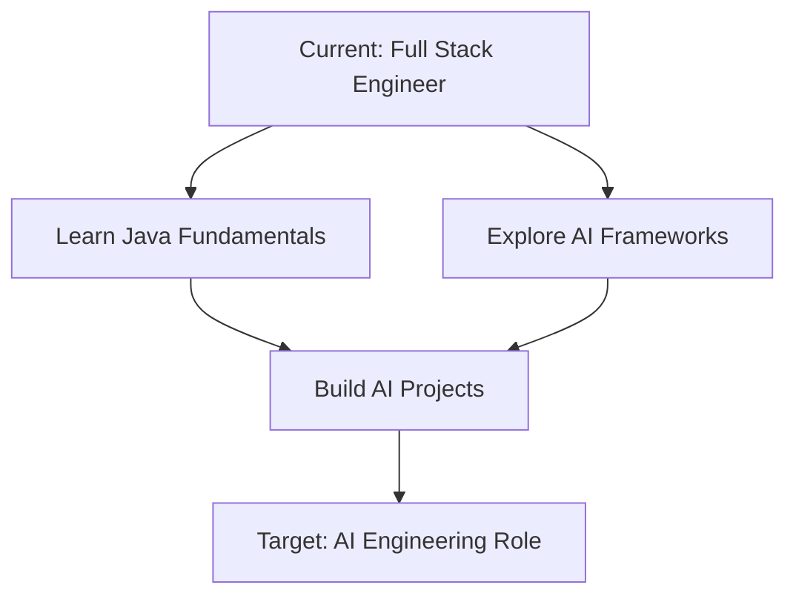

# Job Application Analysis

**Position:** Software Engineer – AI Powered Engineering
**Company:** IMC
**Location:** Chicago

---

## COMPANY INSIGHTS

**Industry:** Not specified
**Size:** Not specified

### About IMC
No information available

### Company Culture
No information available


---

## MISSING KEYWORDS

### ✅ Your Strengths (What You Have)
- BS in Computer Science from UC Berkeley
- Python proficiency
- Production systems experience
- Strong software engineering fundamentals
- Team collaboration and mentoring experience
- Code review experience
- Performance optimization experience
- Testing and CI/CD experience
- Microservices architecture
- 5+ years software engineering experience


### Technical Skills Not on Resume:
- Java
- LangChain
- LangGraph
- AutoGen
- MCP servers
- AI/LLM frameworks
- Machine learning tools
- Vector search
- Embeddings
- Static analysis tools
- Compiler tools
- Model serving infrastructure
- AI evaluation frameworks

### Experience Gaps:
- AI/ML application development
- Agentic AI systems
- LLM integration
- AI code generation workflows
- Retrieval systems development
- AI model fine-tuning
- AI evaluation pipelines
- Production AI systems

### Cloud/Infrastructure:
- None identified

### Frameworks/Tools:
- LangChain
- LangGraph
- AutoGen

### Certifications:
- None identified

### 💡 Addressable Gaps (Can Highlight in Interview)
- Emphasize Python experience and willingness to learn Java
- Highlight experience with complex systems and microservices
- Mention any personal projects with AI/ML tools
- Emphasize curiosity and learning ability
- Connect performance optimization work to AI evaluation pipelines
- Frame testing experience as relevant to AI code validation


### ⚠️ Critical Gaps
- No demonstrated AI/ML experience
- Missing key AI frameworks (LangChain, LangGraph, AutoGen)
- No experience with MCP servers or agentic AI
- Lack of Java experience (preferred language)
- No retrieval systems or vector search background


### 📋 Recommendations
- Take online courses in LangChain, LangGraph, or similar AI frameworks
- Build a personal project using Python AI tools to demonstrate interest
- Learn Java basics to meet preferred language requirement
- Study retrieval systems, vector databases, and embeddings
- Research MCP (Model Context Protocol) and agentic AI concepts
- Emphasize your strong engineering fundamentals and ability to learn quickly
- Highlight performance optimization and testing skills as transferable to AI systems
- Consider mentioning any exposure to AI tools in your current work


---

## REQUIRED SKILLS

### Must Have:
- BS+ in Computer Science (or related) with strong fundamentals (algorithms, data structures, systems)
- Proficiency in a high-level programming language (Java or Python preferred)
- Experience contributing to developer-facing or production systems
- Curiosity and eagerness to learn about AI/LLM application patterns
- Strong communication skills; comfortable working with engineers in a fast, collaborative environment

### Nice to Have:
- Not specified

### Tech Stack:
- Java
- Python
- LangChain
- LangGraph
- AutoGen
- MCP servers

---

## DRAFT COVER LETTER

Dear IMC Hiring Team,

I am writing to express my strong interest in the Software Engineer – AI Powered Engineering position at IMC. Your mission to embed agentic AI directly into production-critical developer workflows represents exactly the kind of transformative engineering challenge I'm passionate about tackling. As a Senior Software Engineer with 5+ years of experience building scalable production systems and a Computer Science degree from UC Berkeley, I'm excited to bring my technical foundation and proven track record to help make AI-generated code reliable, auditable, and fast to ship.

In my current role at TechStart Inc., I've architected and led the development of microservices-based systems serving 50,000+ daily active users, directly relevant to building the large-scale AI infrastructure described in your role. My experience optimizing API performance by 40% through systematic testing and evaluation pipelines closely mirrors the compile/test/evaluate workflows needed for AI-generated code validation. Additionally, my proficiency in Python positions me well to contribute immediately to your tech stack, while my extensive experience with performance-sensitive code paths, telemetry, and configuration hygiene aligns perfectly with IMC's best practices for ensuring reliable AI outputs. I've also mentored junior engineers and conducted code reviews, skills that will be valuable when collaborating with your experienced engineering teams on AI-driven experiments.

While I'm new to specialized AI frameworks like LangChain and AutoGen, I'm genuinely excited about this learning opportunity and have already begun exploring these technologies. My strong computer science fundamentals in algorithms and data structures, combined with my experience building complex production systems, provide an excellent foundation for quickly mastering AI/LLM application patterns. I'm particularly drawn to IMC's pragmatic approach to AI integration and believe my curiosity, proven ability to rapidly acquire new technologies, and systematic approach to performance optimization make me well-suited to help evaluate and improve AI-driven workflows. I'm also eager to expand my language skills to include Java alongside my Python expertise.

I would welcome the opportunity to discuss how my production systems experience, performance optimization skills, and enthusiasm for AI engineering can contribute to IMC's mission of revolutionizing developer workflows with reliable AI integration. Thank you for considering my application, and I look forward to hearing from you.

Sincerely,
Alex Johnson


### Key Selling Points
- Strong technical foundation with CS degree from UC Berkeley and 5+ years building scalable production systems serving 50K+ users
- Proven Python proficiency and performance optimization skills (40% API improvement) directly applicable to AI evaluation pipelines
- Extensive experience with microservices, testing frameworks, and code review processes relevant to AI code validation
- Demonstrated ability to learn new technologies quickly, with genuine enthusiasm for mastering AI frameworks and Java
- Team collaboration and mentoring experience that aligns with IMC's collaborative engineering environment


*Tone: Professional and enthusiastic with authentic acknowledgment of learning opportunities*


---

## RESUME OPTIMIZATION

### Strategic Suggestions
- Update summary to emphasize Python expertise, production systems experience, and interest in AI/ML engineering rather than full-stack web development
- Add a 'Technical Projects' section showcasing any AI/ML experimentation, automation tools, or developer-facing utilities you've built
- Reframe testing and performance optimization experience as directly relevant to AI code evaluation and validation pipelines
- Emphasize algorithms, data structures, and systems knowledge from your CS education to show strong fundamentals for AI work
- Highlight collaboration and mentoring experience more prominently to align with the team-focused, experimental nature of the role


### Keywords to Add (ATS Optimization)
- production-critical systems
- developer-facing
- evaluation pipelines
- static analysis
- performance gates
- telemetry
- configuration management
- systematic analysis
- collaborative development
- algorithms
- data structures
- automation
- monitoring
- quality gates
- best practices
- performance-sensitive code paths


### Sections to Emphasize
- Python experience and Django framework usage
- Performance optimization and systematic analysis work
- Testing frameworks and quality assurance experience
- Production systems and scalability achievements
- Team collaboration and mentoring experience
- CS education with strong fundamentals in algorithms and data structures


### Bullet Point Improvements

**Experience - Senior Software Engineer at TechStart Inc.**

❌ Before:
> Led development of customer-facing dashboard serving 50K+ daily active users

✅ After:
> Led development of production-critical dashboard serving 50K+ daily active users, architecting scalable systems with performance monitoring and telemetry

💡 Why: Emphasizes production-critical systems and telemetry, which are key requirements for the AI engineering role.

**Experience - Senior Software Engineer at TechStart Inc.**

❌ Before:
> Architected microservices backend using Node.js and Express

✅ After:
> Architected microservices backend using Python (Django) and Node.js, implementing automated deployment pipelines and configuration management

💡 Why: Highlights Python experience and configuration management, both critical for the AI role.

**Experience - Senior Software Engineer at TechStart Inc.**

❌ Before:
> Improved API response time by 40%

✅ After:
> Improved API response time by 40% through systematic performance analysis, automated testing pipelines, and code optimization techniques

💡 Why: Connects performance optimization to evaluation pipelines and systematic analysis, relevant to AI code validation.

**Experience - Senior Software Engineer at TechStart Inc.**

❌ Before:
> Mentored 3 junior engineers and conducted code reviews

✅ After:
> Mentored 3 junior engineers and conducted code reviews, establishing best practices for code quality, testing standards, and collaborative development workflows

💡 Why: Emphasizes best practices and collaborative workflows, which are essential for the AI team environment.

**Experience - Software Engineer at Digital Solutions Co.**

❌ Before:
> Wrote comprehensive unit and integration tests (Jest, Cypress)

✅ After:
> Built comprehensive testing and evaluation frameworks using Jest and Cypress, implementing automated quality gates and static analysis checks

💡 Why: Reframes testing experience as evaluation frameworks and quality gates, directly relevant to AI code validation.

**Experience - Software Engineer at Digital Solutions Co.**

❌ Before:
> Optimized database queries

✅ After:
> Optimized database queries and implemented caching strategies, improving system performance through systematic analysis and monitoring

💡 Why: Emphasizes systematic analysis and performance-sensitive code paths mentioned in the job requirements.

**Experience - Software Engineer at Digital Solutions Co.**

❌ Before:
> Participated in on-call rotation and resolved production incidents

✅ After:
> Participated in on-call rotation for production systems, implementing monitoring solutions and automated incident response workflows

💡 Why: Highlights production systems experience and automation, relevant to maintaining reliable AI systems.


---

## INTERVIEW PREPARATION


*Retrieved using hybrid-rrfusion - 15 questions analyzed, avg relevance: 7.5%*


### 🎯 Top Interview Questions


**1. Describe a time you had to learn a new technology quickly**

*Category:* behavioral  
*Why likely:* This role requires learning AI/ML frameworks like LangChain and AutoGen quickly, which the candidate lacks. The interviewer will assess learning agility since the candidate needs to bridge from web development to AI engineering.

**💡 Suggested Answer Template:**
SITUATION: When I joined TechStart Inc., they needed real-time features implemented quickly using WebSockets and Redis pub/sub, technologies I hadn't used in production before. TASK: I had to learn these technologies and implement the solution within a tight 2-week sprint. ACTION: I dedicated evenings to studying documentation, built small proof-of-concepts, and paired with senior engineers for guidance. I also set up monitoring to track performance. RESULT: Successfully implemented real-time features that now serve 50K+ daily users with excellent performance.

**📌 Use These Examples from Your Resume:**
- Implemented real-time features using WebSockets and Redis pub/sub
- Improved API response time by 40%
- Built responsive web applications using React and TypeScript

---


**2. Tell me about a time you improved an existing system**

*Category:* behavioral  
*Why likely:* The role involves improving AI-generated code through evaluation loops and performance optimization. The candidate's experience optimizing systems directly aligns with making AI outputs more reliable and efficient.

**💡 Suggested Answer Template:**
SITUATION: At TechStart Inc., our customer dashboard was experiencing slow API response times affecting 50K+ daily users. TASK: I needed to identify bottlenecks and improve performance without disrupting the live system. ACTION: I analyzed the microservices architecture, implemented caching strategies, optimized database queries, and added performance monitoring. I worked with the team to deploy changes incrementally. RESULT: Improved API response time by 40% and established ongoing performance monitoring practices that the team still uses today.

**📌 Use These Examples from Your Resume:**
- Improved API response time by 40%
- Architected microservices backend using Node.js and Express
- Optimized database queries, reducing load time by 35%

---


**3. How do you ensure code quality in a large codebase?**

*Category:* technical  
*Why likely:* The role involves maintaining code quality for AI-generated code across large codebases with evaluation loops and static analysis. The candidate's testing and code review experience is directly relevant to this responsibility.

**💡 Suggested Answer Template:**
At TechStart Inc., I established several practices for our growing codebase: First, I implemented comprehensive testing strategies using Jest and Cypress for unit and integration tests. Second, I instituted mandatory code reviews and mentored 3 junior engineers on best practices. Third, I set up CI/CD pipelines with automated testing and deployment gates. Fourth, I used static analysis tools and consistent linting rules. Finally, I established documentation standards and regular refactoring sessions to manage technical debt.

**📌 Use These Examples from Your Resume:**
- Wrote comprehensive unit and integration tests (Jest, Cypress)
- Mentored 3 junior engineers and conducted code reviews
- Architected microservices backend using Node.js and Express

---


**4. Tell me about a time you collaborated with multiple teams to deliver a complex project**

*Category:* behavioral  
*Why likely:* The role requires working closely with experienced engineers and platform teams. The candidate's experience collaborating across teams while mentoring others demonstrates the collaborative skills needed for this AI engineering role.

**💡 Suggested Answer Template:**
SITUATION: At TechStart Inc., I was tasked with leading the development of a new customer-facing dashboard that required coordination between engineering, product, and design teams. TASK: I needed to deliver a scalable solution serving 50K+ users while ensuring all teams stayed aligned on requirements and timelines. ACTION: I organized weekly cross-functional meetings, created technical specifications that non-technical teams could understand, mentored junior engineers, and implemented agile methodologies to maintain visibility. I also established code review processes to maintain quality. RESULT: Successfully launched the dashboard on schedule, now serving 50K+ daily users, and the collaborative processes we established became the standard for future projects.

**📌 Use These Examples from Your Resume:**
- Led development of customer-facing dashboard serving 50K+ daily active users
- Mentored 3 junior engineers and conducted code reviews
- Collaborated with product and design teams using agile methodologies

---


**5. How would you approach debugging a performance issue in a production system?**

*Category:* technical  
*Why likely:* The role involves ensuring AI outputs are reliable in production-critical systems. The candidate's experience with performance optimization and production incident resolution directly relates to maintaining AI system reliability.

**💡 Suggested Answer Template:**
I follow a systematic approach: First, I gather metrics and logs to understand the scope and impact - is it affecting all users or specific segments? Second, I use monitoring tools and profiling to identify bottlenecks, similar to how I improved API response time by 40% at TechStart. Third, I reproduce the issue in a staging environment when possible. Fourth, I implement targeted fixes with proper testing, drawing from my experience with comprehensive unit and integration tests. Finally, I implement monitoring and alerting to prevent recurrence, as I did during my on-call rotation at Digital Solutions Co.

**📌 Use These Examples from Your Resume:**
- Improved API response time by 40%
- Participated in on-call rotation and resolved production incidents
- Wrote comprehensive unit and integration tests (Jest, Cypress)

---


### 🌟 What to Emphasize
- Highlight your strong Python experience with Django framework to align with their preferred languages (Python/Java)
- Emphasize your systematic approach to performance optimization and testing as directly applicable to AI evaluation pipelines
- Showcase your mentoring and collaborative experience as evidence of ability to work with experienced AI engineers
- Frame your CS fundamentals from UC Berkeley as providing the algorithmic foundation needed for AI engineering work

### 📚 Preparation Tips
- Research MCP (Model Context Protocol) and agentic AI concepts to show genuine interest and preparation for the role transition
- Prepare specific examples of how your testing frameworks and performance optimization work relates to AI code validation and evaluation
- Practice explaining complex technical concepts clearly, as you'll be working with both AI specialists and platform teams
- Prepare thoughtful questions about their AI integration challenges and how they measure AI code quality and reliability

*Questions retrieved from knowledge base using RAG with hybrid search*


---

## 🎨 CAREER PATH VISUALIZATION


### Career Roadmap



### Interactive Visualizations

The following interactive visualizations have been generated:

- **Skills Radar Chart**: `./output/visualizations/skills-radar.html`
  - Open in your browser to see an interactive comparison of your skills vs. job requirements
  
- **Career Timeline SVG**: `./output/visualizations/timeline.svg`
  - Visual timeline showing your path to the target role over 12 months

📂 All visualizations saved to: `./output/visualizations/`

**How to view:**
```bash
# Skills radar (interactive)
open ./output/visualizations/skills-radar.html

# Timeline
open ./output/visualizations/timeline.svg

# Roadmap (paste into https://mermaid.live)
cat ./output/visualizations/roadmap.mmd
```


---

## JOB DETAILS

### Summary
IMC is embedding agentic AI directly into the developer workflow for our production-critical systems. As a member of the Agentic AI engineering team, you'll help build agents, MCP servers, and evaluation loops that make AI-generated code reliable, auditable, and fast to ship. You'll work closely with experienced engineers and platform teams to deliver pragmatic, high-impact AI integrations at scale.

### Key Responsibilities
- Contribute to the platform by implementing agents, MCP servers, and supporting services that propose and apply changes to large codebases
- Assist in developing retrieval systems that give AI agents and developers accurate, up-to-date context from large codebases and design artifacts
- Help measure and improve AI-generated changes by building compile/test/evaluate pipelines (static analysis, style and safety checks, performance gates, code review)
- Apply IMC's best practices in concurrency, telemetry, configuration hygiene, and performance-sensitive code paths to ensure AI outputs are reliable and idiomatic
- Collaborate with teammates on experiments to evaluate and improve AI-driven workflows

### Qualifications
- BS+ in Computer Science (or related) with strong fundamentals

---

## YOUR PROFILE

**Name:** Alex Johnson
**Total Experience:** 5+ years

### Professional Summary
Passionate Full Stack Software Engineer with 5+ years of experience building scalable web applications. Expertise in JavaScript/TypeScript, React, Node.js, and cloud platforms.


### Technical Skills
JavaScript, TypeScript, Python, SQL, HTML/CSS, React, Next.js, Vue.js, Redux, Tailwind CSS, Node.js, Express, Django, REST APIs, GraphQL

### Recent Experience
**Senior Software Engineer** at TechStart Inc. (June 2021 - Present)
**Software Engineer** at Digital Solutions Co. (January 2019 - May 2021)


---

*Generated on 12/9/2025, 3:59:37 PM*
